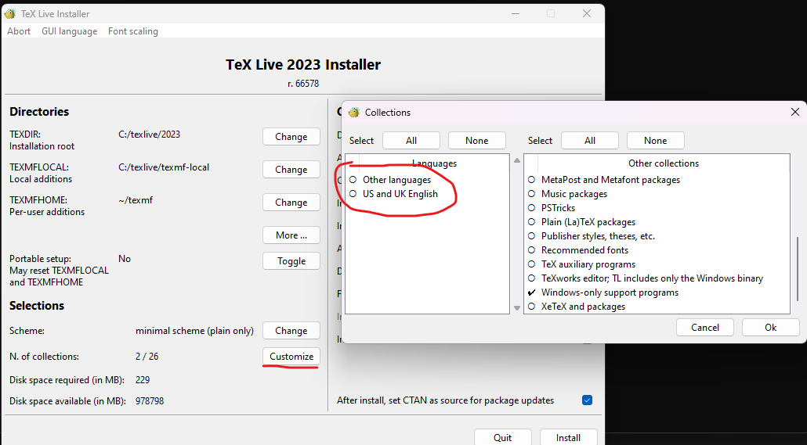
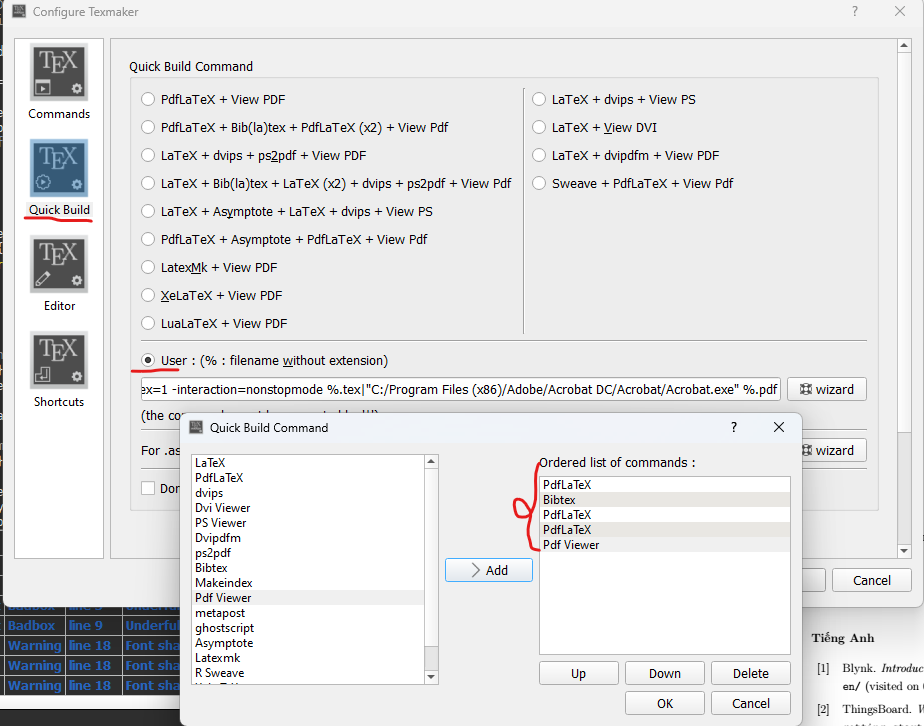

# Hướng dẫn sử dụng offline latex template

- Hệ thống soạn thảo Tex: [TeXLive](https://tug.org/texlive/).
- Cấu hình cài đặt TeXLive của cá nhân sinh viên:

	
- Editor: [Texmaker](https://www.xm1math.net/texmaker/).
	- Cấu hình build template của báo cáo KLTN:
		1. Vào Options &rarr; Configure Texmaker
		2. Trong tab **Quick Build**, chọn User &rarr; wizard và chọn trình tự build: PdfLaTeX &rarr; Bibtext &rarr; PdfLaTeX &rarr; PdfLaTeX &rarr; Pdf viewer.
		.
	- Cấu hình build template của bản trình bày KLTN:
		1. Vào Options &rarr; Configure Texmaker
		2. Trong tab **Quick Build**, chọn User &rarr; wizard và chọn trình tự build: XeLaTeX &rarr; XeLaTeX &rarr; Pdf viewer.
